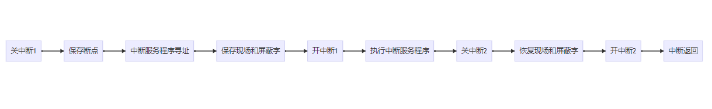

# 第一章 计算机系统概述

## 并发、共享、虚拟、异步

没有并发和共享，就没有虚拟和异步

并发和共享互为存在条件

只有系统有并发性，才能导致异步性

## 命令接口

联机：交互式

脱机：批处理

## 程序接口

系统调用（广义指令）

## 操作系统用作扩充机器

没有任何软件支持的计算机称为裸机

覆盖了软件的机器称为**扩充机器**或**虚拟机**

## 操作系统发展

手工操作系统：独占全机、CPU等待手工操作

单道批处理操作系统：解决人机矛盾、CPU和I/O设备速率不匹配、每次主机内存仅存放一道作业

多道批处理操作系统：资源利用率高、用户响应时间长、不提供人机交互

分时操作系统：同时、交互、独立、及时

实时操作系统：及时、可靠

网络操作系统

分布式计算机系统

个人操作系统

## 操作系统运行机制

CPU的状态划分为用户态、核心态

## 中断和异常

中断（外中断）：CPU执行指令意外的事件【设备发出的I/O结束中断】

异常（内中断、陷入）：CPU执行指令内部的事件【非法操作码、地址越界、算术溢出、虚拟存储系统的缺页、陷入指令】

## 中断处理过程

## 系统调用

用户程序中调用操作系统提供的子功能

程序员可以使用高级语言，估计又要可以调用库函数，有的库函数封装了系统调用

用户进程执行 调用系统调用 **进入核心态** 执行系统调用 **退出核心态** 从系统调用返回

## 大内核 微内核

大内核：内核代码庞大、结构混乱、难以维护、提供高性能系统服务

微内核：分离内核与服务、频繁切换用户核心态、操作系统执行开销大、内核内容少、方便维护

# 第二章 进程管理

进程:程序段、数据段、PCB进程控制块

进程映像是静态的，进程是动态的

动态、并发、独立、异步、结构

## 进程状态

运行、就绪、阻塞、创建、结束

## 进程通信

共享存储（需要同步互斥工具PV操作、低级：基于共享数据结构、高级：基于存储区）

消息传递（进程间数据交换以格式化消息为单位、直接/间接）

管道通信（pipe文件用于连接一个读进程和写进程通信、半双工、全双工需要两条管道）

## 线程 多线程

引入进程目的：更好的使多道程序**并发**执行

引入线程目的：减小程序在并发执行付出的时空开销，提高并发性能

线程：线程ID、程序计数器、寄存器结合、堆栈组合、三态【就绪、阻塞、运行】

轻量实体，无系统资源，唯一ID和线程控制块

用户级线程ULT：操作系统意识不到ULT的存在，有关线程管理由应用程序完成

内核级线程KLT：有关线程管理由内核完成

多线程模型：多对一、一对一、多对多（m<=n）

## 处理机调度

调度层次：作业调度（高）、内存调度（中）、进程调度（低）

不能进行进程调度与切换：处理中断、进程处于内核态、其他需要完全屏蔽中断的原子操作

调度方式：非剥夺调度（非抢占方式、适用于大多批处理系统、不能用于分时系统和大多数的实时系统）、剥夺调度（抢占方式、有优先权、短进程优先、时间片原则）

调度基本原则：CPU利用率、系统吞吐量、周转时间、等待时间、响应时间

系统吞吐量：单位时间内CPU完成作业的数量

周转时间：从作业提交到作业完成所用时间

$$
\begin{aligned}
&T=t_{等待}+t_{就绪队列排队}+t_{上处理机运行及输入输出}\\
&t_{周转时间}=t_{作业完成时间}-t_{作业提交时间}\\
&t_{平均周转时间}=\frac{\sum_i^n{t_i}}{n}(作业i的周转时间：t_i)\\
&t_{带权周转时间}=\frac{t_{作业周转时间}}{t_{作业实际运转}}\geq{1}\\
&t_{带权平均周转时间}=\frac{\sum_i^n{t_i}}{n}(作业i的带权周转时间：t_i)\\
\end{aligned}
$$

等待时间：进程处于等处理机状态的时间和

响应时间：从用户提交请求到系统首次产生响应所用时间

**调度算法**：先来先服务（FCFS、非抢占）、短作业优先（SJF、SPF）、抢占式短作业优先（SRTN）、优先级调度、高响应比优先（HRRN）、时间片轮转调度（RR）、多级反馈队列调度

1.先来先服务（FCFS）：简单，效率低；对长作业有利，对短作业不利；有利于CPU繁忙型作业，不利于I/O繁忙型作业；不会导致饥饿；多用于早期批处理系统

2.短作业优先（SJF、SPF）：当前已到达的最短作业先上处理机；有优先权、短进程优先、时间片原则；适用于实时/分时操作系统；调度机制导致长作业长时间不被调度（饥饿）；多用于早期批处理系统

3.抢占式短作业优先（SRTN）：最短剩余时间算法

4.优先级调度：适用于实时操作系统；剥夺、非剥夺、静态优先级、动态优先级；系统进程>用户进程 交互型进程>非交互型进程 I/O型进程>计算型进程;不导致饥饿

5.高响应比优先（HRRN）：多用于早期批处理系统

$$
\begin{aligned}
&响应比R_p=\frac{t_{等待时间}+t_{要求服务时间}}{t_{要求服务时间}}\geq{1}\\
\end{aligned}
$$

6.时间片轮转调度（RR）：时间片大小设置对系统性能影响很大，时间片足够大，以至于所有进程都能在一个时间片完成，退化为先来先服务算法；时间片太小，处理机频繁在进程间切换，增加处理机开销；时间片长短由系统的响应时间、就绪队列的进程数目、系统处理能力决定；不会导致饥饿

7.多级反馈队列调度：设置多个就绪队列，各个队列赋予不同优先级，赋予各个队列中进程执行时间片的大小各个不同，一个进程进入内存后挂在一级队列队尾，时间片内未完成进入第二级队列队尾，第一级队列为空下一级运行；课本认为是抢占式算法；

## 进程同步

临界资源：进入区、临界区、退出区、剩余区

同步：完成某种任务而建立的两个或多个进程，需要协调制约关系

互斥：一个进程使用临界资源另一个进程必须等待，当占用临界资源的进程退出临界区后，另一进程允许访问临界资源

